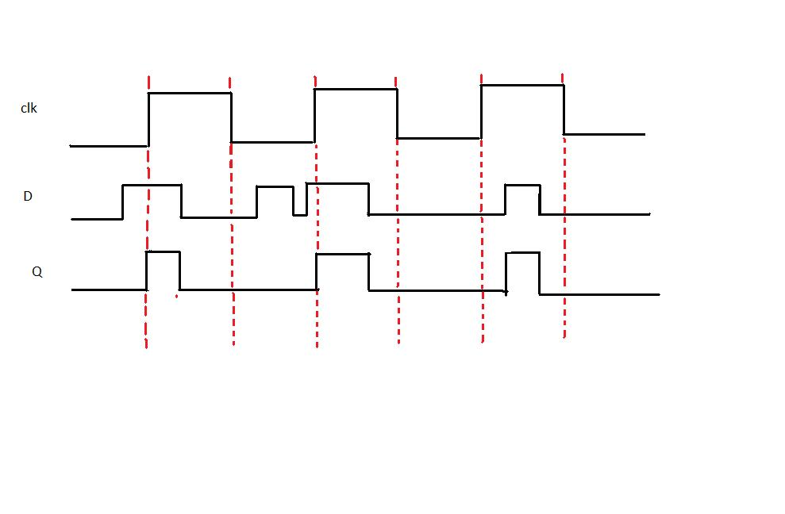
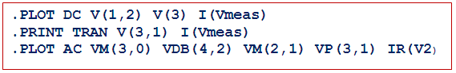
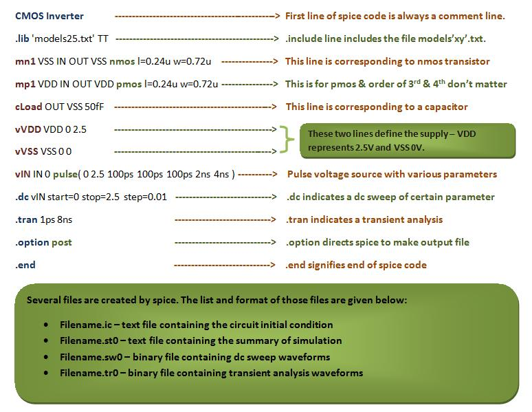
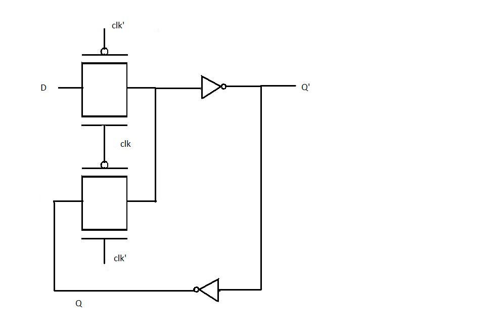
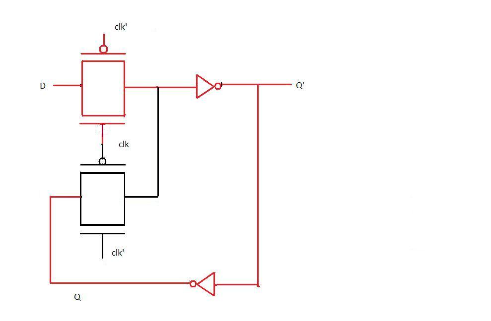
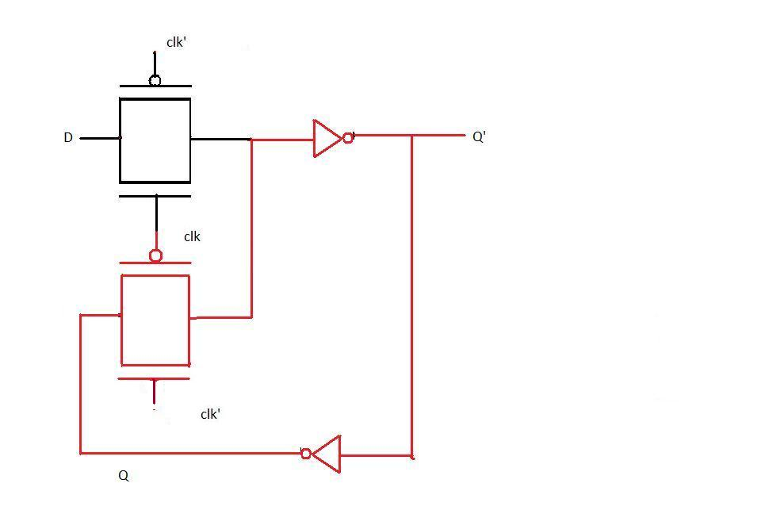

### D-Latch Fundamentals

#### Transparency Property of D-Latch

The transparency property of a D-Latch refers to its ability to allow the input data (D) to pass directly to the output (Q) when the clock (CLK) signal is active (typically high). In this transparent state, any changes in the input D are immediately reflected at the output Q. This property is crucial for temporary data storage and transfer in sequential circuits, as it enables the latch to act as a buffer when the clock is high. When the clock goes low, the latch becomes opaque, holding the last value of D and ignoring further changes until the clock is activated again.

**Key Points:**

- Transparent state: Q follows D when CLK is high.
- Opaque (latched) state: Q holds its value when CLK is low.

Latch is an electronic device that can be used to store one bit of information. The D latch is used to capture, or 'latch' the logic level which is present on the Data line when the clock input is high. If the data on the D line changes state while the clock pulse is high, then the output, Q, follows the input, D. When the CLK input falls to logic 0, the last state of the D input is trapped and held in the latch.

**Timing diagram:**

From the timing diagram it is clear that the output Q's waveform resembles that of input D's waveform when the clock is high whereas when the clock is low Q retains the previous value of D (the value before clock dropped down to 0)

**Note**: D-latch is a level triggering device.

### SPICE - Introduction and Fundamentals

In the experiments we have done till now we have designed gates by arranging transistors in various fashions. The simulation of these designs gave graphs of output voltages and we analyzed how these graph changes with varying different parameters of the transistor. Now when you place a transistor on screen there is a back end code which tells a simulator what are the points to which the transistor's substrate, gate, drain, source are connected. The language in which this information is conveyed is spice.

**INTRODUCTION TO SPICE**

SPICE (Simulation Program with Integrated Circuit Emphasis) is a powerful program that is used in integrated circuit and board-level design to check the integrity of circuit designs and to predict circuit behavior. SPICE was originally developed at the Electronics Research Laboratory of the University of California, Berkeley (1975). Simulating the circuit with SPICE is the industry-standard way to verify circuit operation at the transistor level before committing to manufacturing an integrated circuit. In spice program, circuit elements (transistors, resistors, capacitors, etc) and their connections being translated into a text net list.

Several types of circuit analyses can be done using SPICE program. Here are the most important ones:

- DC analysis: calculates the DC transfer curve.
- Transient analysis: calculates the voltage and current as a function of time when a large signal is applied.
- AC Analysis: calculates the output as a function of frequency. A bode plot is generated.
- Noise analysis.
- Sensitivity analysis.
- Distortion analysis.
- Fourier analysis: calculates and plots the frequency spectrum.
- Monte Carlo Analysis

All analyses can be done at different temperatures. The default temperature is 300K.

### SPICE Structure and Syntax

A spice input file, also called source file, consists of three parts:

- **Data statements:** These statements are description of the components and their interconnections.

- **Control statements:** These statements are responsible to tell SPICE simulator what type of analysis to perform on the circuit.

- **Output statements:** These statements specify what outputs are to be printed or plotted.

Although these statements may appear in any order, it is recommended that they be given in the above sequence. Two other statements are required: the title statement and the end statement. The title statement is the first line and can contain any information, while the end statement is always .END. The title statement must be a line or word. In addition, you can insert comment statements, which must begin with an asterisk (\*) and are ignored by SPICE Simulator.

**1. Data Statements**

(A) Independent DC Sources

N1 is the positive terminal node. N2 is the negative terminal node. Type can be DC, AC or TRAN, depending on the type of analysis. Value gives the value of the source. The name of a voltage and current source must start with V and I, respectively.

The positive current direction through the current or voltage source is from the positive (N1) node to the negative (N2) node:

(B) Elements: for example MOSFETS

The MOS transistor name (Mname) has to start with a M; ND, NG, NS and NB are the node numbers of the Drain, Gate, Source and Bulk terminals, respectively. ModName is the name of the transistor model (NMOS or PMOS). L and W are the length and width of the gate (in m).

**2. Commands or Control Statements:**

.TRAN Statement

This statement specifies the time interval over which the transient analysis takes place, and the time increments. The format is as follows: TSTEP is the printing increment. TSTOP is the final time TSTART is the starting time (if omitted, TSTART is assumed to be zero) TMAX is the maximum step size. UIC stands for Use Initial Conditions. If UIC is specified then simulator will use the initial conditions specified in the element statements.

**3. Output Statements**

These statements will instruct Simulator what output to generate. If you do not specify an output statement, Simulator will always calculate the DC operating points. The two types of outputs are the prints and plots. A print is a table of data points and a plot is a graphical representation. The format is as follows:

In above format TYPE specifies the type of analysis to be printed or plotted and can be:

The output variables are Y1, Y2 and can be voltage or currents in voltage sources. Node voltages and device currents can be specified as magnitude (M), phase (P), real (R) or imaginary (I) parts by adding the suffix to V or I as follows:

- M: Magnitude.
- DB: Magnitude in dB (decibels).
- P: Phase.
- R: Real part.
- I: Imaginary part.

### SPICE Netlist Example - Inverter Circuit

Complete example (Inverter-Netlist):

In introduction of this experiment we have seen what is spice actually. In first experiment we have designed inverter, so as we have read in introduction that whenever you place anything like transistor or capacitor etc., there is a code which is written at back end corresponding to the element placed on screen. So in this experiment we are going to learn what is that code which is written in the back end, that is, we learn how to write that code directly, that is, we will learn basic inverter designing using spice coding.

The following is the code for inverter in spice along with some of the explanation.

Now we will be learning actually what parameters are specified by each of the element in every line in detail:

**FIRST LINE**

First line of spice code is always a comment. So this line is always ignored by spice. Spice does not do any kind of processing on this line.

**INCLUDE LINE**

.include line includes the model file but you should confirm that your model file should be in your current directory in which you are working.

1. **.lib 'models25.txt'**

   - This line includes a library file named 'models25.txt.' The library file typically contains information about models for various components used in the circuit.

2. **mn1 VSS IN OUT VSS nmos l=0.24u w=0.72u**

   - Defines an nmos transistor named 'mn1' with specific characteristics:
     - `mn1`: Instance name.
     - `VSS IN OUT VSS`: Connections for source, gate, drain, and bulk (substrate).
     - `nmos`: Specifies the transistor type.
     - `l=0.24u`: Sets the length to 0.24 microns.
     - `w=0.72u`: Specifies the width of the transistor as 0.72 microns.

3. **mp1 VDD IN OUT VDD pmos l=0.24u w=0.72u**

   - Similar to the previous line but for a pmos transistor:
     - `mp1`: Instance name.
     - `VDD IN OUT VDD`: Connections for source, gate, drain, and bulk.
     - `pmos`: Specifies the transistor type.
     - `l=0.24u`: Sets the length to 0.24 microns.
     - `w=0.72u`: Specifies the width of the transistor as 0.72 microns.

4. **cLoad OUT VSS 50fF**

   - Defines a capacitor named 'cLoad':
     - `OUT VSS`: Connections for one terminal connected to OUT and the other to VSS.
     - `50fF`: Specifies the capacitance of the capacitor as 50 femtofarads.

5. **vVDD VDD 0 2.5**

   - Defines a voltage source named 'vVDD':
     - `VDD 0`: Connections for positive terminal to VDD and negative terminal to the reference node (0 volts).
     - `2.5`: Specifies the voltage value as 2.5 volts.

6. **vVSS VSS 0 0**

   - Defines a voltage source named 'vVSS':
     - `VSS 0`: Connections for positive terminal to VSS and negative terminal to the reference node (0 volts).
     - `0`: Specifies the voltage value as 0 volts.

7. **VIN IN 0 pulse(0 2.5 100ps 100ps 100ps 2ns 4ns)**

   - Defines a pulse voltage source named 'VIN':
     - `IN 0`: Connections for positive terminal to IN and negative terminal to the reference node (0 volts).
     - `pulse(0 2.5 100ps 100ps 100ps 2ns 4ns)`: Specifies the pulse characteristics:
       - `0 2.5`: Pulse amplitude from 0 to 2.5 volts.
       - `100ps`: Rise time.
       - `100ps`: Fall time.
       - `100ps`: Pulse width.
       - `2ns`: Period.
       - `4ns`: Delay.

8. **.dc vIN start=0 stop=2.5 step=0.01**

   - Specifies a DC sweep analysis of the voltage source 'vIN':
     - `start=0`: Starting voltage value.
     - `stop=2.5`: Ending voltage value.
     - `step=0.01`: Voltage step size.

9. **.tran 1ps 8ns**

   - Specifies a transient analysis with:
     - `1ps`: Time step of 1 picosecond.
     - `8ns`: Total simulation time of 8 nanoseconds.

10. **.option post**

    - Sets a post-processing option, which may include additional analysis or data extraction after the simulation. This line directs spice to make an output file

11. **.end**
    - Marks the end of the spice code.

### D-Latch Implementation using Pass Transistor Logic

With the definition of D latch (given in the introduction) and the background knowledge of pass transistor (acquired in the previous experiments) let us design the transistor level diagram of D latch in this experiment. As mentioned earlier, when the clock is high the input D propagates to the output Q as it is and when the clock is low the output is held (irrespective of the changes in input D). This definition indicates that D latch can be implemented as a multiplexer with clock signal as the select input of multiplexer.

Applying analogy, we realize that when clock=1 the input to the CMOS pass transistor should be D and when clock=0 the input to the pass transistor should be value of D just before the transition of clock from 1 to 0. To obtain the value of D just before transition a buffer is needed. The final design is given below:

**Working of the latch when clock is 1:**

When clock is 1 the pass transistor in red is on (the input to the gate of nmos is 1 and to the gate of pmos is 0) therefore the output is D. As D changes the output changes accordingly. The two inverters act as a buffer.

**Working of the latch when clock is 0:**

When clock is 0 the pass transistor in red is on and the one connected to the input D is off thus any changes in D does not affect the circuit. If we observe the transistor in red is connected to the buffer at the output which loops back to its input thus the same value occurs at Q' again and again till this pass transistor is on.
